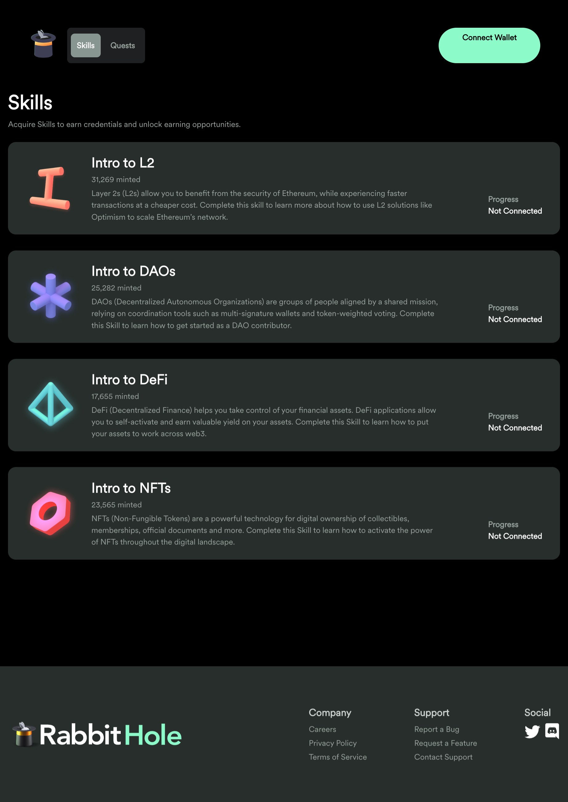

# FraktonHackathon2023

## Quest Booster

Author: @0xShin0221 

<style scoped>
h1 {
    padding-top: 1.5em;
}
</style>

---

いきなりですが

### Q: DAO のオンボーディングって大変？

```
> DAO のオンボーディング
1. とある DAO に初めて参加する人の為に
2. インセンティブを用意し
3. やってもらいたいことを Quest 等として用意

```

---

## 課題３つ

---

# 1.Fully-OffcChain UX

- オンボーディングのクエスト内容を議論
- オンボーディングのクエストを作成
- Autonomous にインセンティブの分配

`Yes 中央集権!!!`:smile:

---

## 2.OnChain Proposal の Bad UX

- Create Quest Proposal
  - オンチェーンの Proposal の Vote 時に
    - マルチプルセレクトやドラフトレベルのディスカッション:x:

`現状`

- 択一式 Against,For,Abstain
- Forum で、オフチェーンなディスカッション

---

## 3. Quest Protocol



---

## 3. Quest Protocol

- Create Quest
  - 現状
    - Admin が自由に勝手に作成
      ↘️ DAO の意思決定(OnChain-Gov)フロー :x:
  - 理想
    - DAO の Governance に沿って Holder によって作成、決議されるべき

---

### BUIDL

# Quest Booster🚀

---

## QuestBooster

A Dark theme for [Marp](https://marp.app)

Explore the many features of Marp in style!

_Daniel Nicolas Gisolfi_

<style scoped>
h1 {
    padding-top: 1.5em;
}
</style>


---

# How it works

1. Create Idea for DAO onboarding
2. Holder Discussion
3. `Delegate()` and `CreateProposal()` as Autonomous

---

## 補足スライド

---

### Tecchnical

#### `What and why at the protocol level`

- rabbithole.gg: DAO Extender for Enhanced Functionality
  - Not 　 Clone
- Proposal
  - PreCreateProposal
    - Decentralized Full On-Chain Onboarding Forum
    - Delegate for CreateProposal

---

# Deployed Contracts

| Year | Title          | Actor             |
| ---- | -------------- | ----------------- |
| 1970 | Jonathan       | Paul Albert Krumm |
| 1995 | Monster Mash   | Anthony Crivello  |
| 2004 | Blade: Trinity | Dominic Purcell   |
| 2008 | Supernatural   | Todd Stashwick    |
| 2020 | Dracula        | Claes Bang        |

<style scoped>
table {
    margin-left: auto;
    margin-right: auto;
}
</style>

---

# Bats - Implementation

```python
class Bat:
    def __init__(name:str, age:int):
        self.__name = name
        self.__age = age
    @property
    def name(self):
        return self.__name
    @property
    def age(self):
        return self.__age
    @property
    def speed(self):
        return 10 - self.age
```
